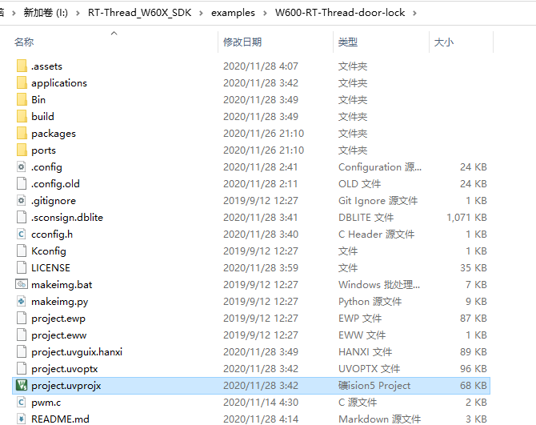
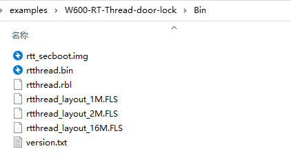

# W600-RT-Thread智能指纹门锁编译指南

## 1.RT-Thread 简介

[RT-Thread](http://www.rt-thread.org/) 是一个来自中国的开源物联网操作系统，它具备非常强的可伸缩能力：从一个可以运行在ARM Cortex-M0 芯片上的极小内核，到中等的 ARM Cortex-M3/4/7系统，甚至是运行于 MIPS32、ARM Cortex-A 系列处理器上。 RT-Thread项目的源代码托管在 [GitHub repo](https://github.com/rt-thread) 上。

## 2.准备工作

-   W60x\_RT-Thread源码：（请先使用GitHub版本 <https://github.com/RT-Thread/W601_IoT_Board>）
-   RT-Thread env工具：https://github.com/RT-Thread/env
-   串口下载工具：[串口调试助手](https://download.w600.fun/tool/%E6%98%9F%E9%80%9A%E6%99%BA%E8%81%94%E4%B8%B2%E5%8F%A3%E8%B0%83%E8%AF%95%E4%B8%8B%E8%BD%BD%E5%8A%A9%E6%89%8B.7z)

## 3.环境搭建

### 3.1编译环境搭建

该SDK可以由Keil MDK直接编译

### 3.2 工程目录介绍

docs文件夹下放着W600\_RTT相关的参考文档，建议先阅读 `UM3103-RT-Thread-W60X-SDK 快速上手.pdf `和 `UM3101-RT-Thread-W60X-SDK开发手册.pdf`

## 4.编译烧录

### 4.1 编译
将仓库克隆放到工程目录examples文件夹内

进入项目文件夹，双击 `project.uvprojx`工程文件，直接编译即可（注意，一定要先搭建好Keil环境）。

固件生成在当前示例所在目录的Bin文件夹下。

### 4.2 烧录

注意事项：

1.  本项目使用W600芯片，FLASH为1M版本，选择`rtthread_layout_1M.FLS`烧录
6.  其它烧录问题请参考:[W600固件烧录指南](https://github.com/w600/docs/blob/master/zh/app/download.md)

